# Design Document

## Overview

The HRM Decision Agent is a sophisticated task execution system that implements Hierarchical Reasoning with Memory (HRM) patterns using a small LLM as the primary controller, with escalation to a larger LLM when needed. The system uses an H/L (High-level/Low-level) loop with ACT (Adaptive Control of Thought) for dynamic halting decisions.

The architecture follows A2A Protocol patterns for task management and agent communication, while using OpenAI Completions API for LLM interactions. It prioritizes cost efficiency by using gpt-5-nano for most operations, only escalating to gpt-5 when the small model fails or exceeds budget constraints.

## Architecture

### Core Components

```mermaid
graph TB
    A[Agent Controller] --> B[State Manager]
    A --> C[Configuration Manager]
    
    B --> D[Planner H]
    B --> E[Executor L]
    B --> F[Verifier]
    B --> G[ACT Gate]
    B --> H[Escalator]
    
    D --> I[LLM Provider]
    E --> J[Tool Registry]
    F --> K[Task-specific Verifiers]
    
    J --> L[Calculator]
    J --> M[Calendar]
    J --> N[Stock Data]
    J --> O[Analysis Tools]
    J --> P[Plotter]
    
    Q[Runner] --> A
    R[Config YAML] --> C
    S[Test Dataset] --> Q
```



### System Flow


## Components and Interfaces

### State Manager

**Purpose**: Central state management for agent execution following A2A Task patterns
**Interface**:
```python
class AgentState:
    # A2A Task-compatible identity
    id: str  # UUID task identifier
    contextId: str  # A2A context grouping
    user_input: str
    expected_tools: List[str]
    gold_answer: Optional[str]
    
    # A2A Task execution state
    plan: List[Action]
    evidence: List[Dict]  # Similar to A2A Message history
    artifacts: Dict[str, Any]  # A2A Artifact format
    
    # HRM Control state
    tier: Literal["small", "big"]
    llm_calls_small: int
    llm_calls_big: int
    tool_calls: int
    act_steps: int
    best_metric: float
    stalled_rounds: int
    
    # A2A TaskStatus compatible results
    verified: bool
    finish_reason: Optional[Literal["success", "budget", "big_fail"]]
    answer: Optional[str]
    logs: List[Dict]  # A2A-style structured logs
    
    # A2A Task state tracking
    state: Literal["submitted", "working", "completed", "failed", "canceled"]
    timestamp: str  # ISO 8601
```

### Planner (H - High Level)

**Purpose**: Generate 1-3 action plans using OpenAI Completions API
**Interface**:
```python
def planner_H(state: AgentState, model_name: str) -> List[Action]
```

**OpenAI Completions Integration**:
```python
# Completions API call structure
completion_request = {
    "model": model_name,  # "gpt-5-nano" or "gpt-5"
    "prompt": formatted_prompt,
    "max_tokens": 500,
    "temperature": 0.1,
    "stop": ["\n\n"]
}
```

**JSON Schema Validation** (A2A-inspired):
```json
{
  "type": "array",
  "minItems": 1,
  "maxItems": 3,
  "items": {
    "type": "object",
    "required": ["tool", "args"],
    "properties": {
      "tool": {"type": "string"},
      "args": {"type": "object", "additionalProperties": true}
    },
    "additionalProperties": false
  }
}
```

**Prompting Strategy**:
- Small model: Concise, direct planning prompts
- Big model: Include failure context and sophisticated reasoning
- Response parsing: Extract JSON from completion text

### Executor (L - Low Level)

**Purpose**: Execute planned actions using tool registry
**Interface**:
```python
def executor_L(state: AgentState) -> None
```

**Error Handling**:
- Tool exceptions → `{"error": "...", "code": "..."}` in evidence
- Unknown tools → log warning and skip
- Network errors → retry with exponential backoff

### Verifier

**Purpose**: Determine task completion and quality metrics
**Interface**:
```python
def verifier(state: AgentState) -> Tuple[bool, float]
```

**Task-Specific Logic**:
- Math tasks: Extract numeric values and compare with gold_answer
- Calendar tasks: Normalize date format and exact match
- Stock tasks: Validate data completeness, MA calculation, and plot generation

### ACT Gate

**Purpose**: Adaptive halting control
**Interface**:
```python
def act_gate(state: AgentState, passed: bool, metric: float, config: Config) -> Literal["stop", "continue", "escalate"]
```

**Decision Logic**:
1. If passed → "stop" with success
2. Update progress metrics and stall detection
3. Check budget constraints (steps, calls, time)
4. Apply escalation policy based on `escalate_when` setting

### Tool Registry

**Purpose**: Centralized tool management with A2A-style error isolation
**Interface**:
```python
class ToolRegistry:
    def execute(self, tool_name: str, args: Dict) -> Dict[str, Any]
```

**A2A-Compatible Tool Responses**:
- `calculator(expr)` → `{"value": "result", "kind": "data"}`
- `calendar(query, today)` → `{"date_str": "formatted_date", "kind": "text"}`
- `data_fetch_stock(ticker, n)` → `{"series": [...], "kind": "data"}`
- `numeric_analysis(series)` → `{"ma7": [...], "stats": {...}, "kind": "data"}`
- `plotter(series, ma7)` → `{"image_path": "path/to/plot.png", "kind": "file"}`

**Standardized Error Taxonomy**:
```python
# Error codes that executor MUST return (never throw exceptions)
ERROR_CODES = {
    "TOOL_ERROR": "General tool execution failure",
    "NET_TIMEOUT": "Network timeout during tool call",
    "RATE_LIMIT": "Rate limit exceeded",
    "INVALID_ARGS": "Invalid arguments provided to tool",
    "UNKNOWN_TOOL": "Tool not found in registry",
    "FILE_TOO_LARGE": "File exceeds max_artifact_mb",
    "INVALID_FILE_TYPE": "File extension not in allowed list",
    "PATH_TRAVERSAL": "Attempted path traversal attack"
}

# Error format (A2A-inspired)
{
    "error": "Tool execution failed",
    "code": "TOOL_ERROR",  # From ERROR_CODES above
    "details": {"tool": "calculator", "args": {...}},
    "kind": "error",
    "timestamp": "2025-01-01T00:00:00+07:00",
    "step_id": "uuid-here"
}
```

## Data Models

### Configuration Schema

```yaml
models:
  small_model: str  # "gpt-5-nano"
  big_model: str    # "gpt-5"

budget:
  max_llm_calls_small: int  # 6
  max_llm_calls_big: int    # 2
  max_tool_calls: int       # 6
  max_seconds: int          # 60

act:
  max_steps: int            # 3
  no_progress_patience: int # 1
  min_improvement: float    # 0.01 (1.0 for binary tasks)

flags:
  escalate_when: str        # "fail_or_budget"
  allow_big_retry_once: bool # true

limits:
  max_input_chars: int      # 8192
  max_artifact_mb: int      # 5
  max_prompt_tokens: int    # 4000
  max_completion_tokens: int # 1000

telemetry:
  enable_token_cost: bool   # true
  redact_pii: bool         # true
  timezone: str            # "Asia/Bangkok"

security:
  allowed_file_extensions: List[str]  # [".png", ".jpg", ".json", ".txt"]
  sanitize_filenames: bool # true
  max_concurrent_tool_calls: int # 3

ci_gates:
  min_success_rate: float   # 0.95
  max_escalation_rate: float # 0.15
  max_plan_schema_error_rate: float # 0.02
  max_p95_latency_seconds: float # 2.0
```

### Log Entry Schema

**Enhanced Logging with Correlation**:
```python
@dataclass
class LogEntry:
    # Correlation and tracing
    ts: str  # ISO-8601 timestamp with timezone
    run_id: str  # UUID for entire run_case execution
    task_id: str  # A2A-style task identifier
    step_id: str  # UUID for this specific step
    parent_step_id: Optional[str]  # For nested operations
    
    # Execution context
    tier: Literal["small", "big"]
    step_type: Literal["H_plan", "L_exec", "verify", "act", "escalate"]
    prompt_id: Optional[str]
    
    # OpenAI Completions API usage tracking
    token_usage: Optional[Dict[str, Union[int, float]]]  # {completion_tokens, prompt_tokens, total_tokens}
    model: Optional[str]  # "gpt-5-nano" or "gpt-5"
    
    # Tool execution details
    tool: Optional[str]
    args: Optional[Dict]  # Redacted based on config
    output_summary: Optional[str]
    error_code: Optional[str]  # TOOL_ERROR, NET_TIMEOUT, RATE_LIMIT, etc.
    
    # HRM-specific metrics
    metric: Optional[float]
    decision: Optional[Literal["stop", "continue", "escalate"]]
    
    # A2A-style metadata
    kind: Literal["log"]
    metadata: Optional[Dict[str, Any]]
    
    def redact(self, fields: List[str]) -> 'LogEntry':
        """Redact sensitive fields based on allowlist/denylist"""
        pass
```

### Action Schema

**A2A-Inspired Action Format**:
```python
@dataclass
class Action:
    tool: str
    args: Dict[str, Any]
    kind: Literal["action"] = "action"  # A2A-style discriminator
    metadata: Optional[Dict[str, Any]] = None
```

## Error Handling

### Retry Strategies

**LLM Provider Errors** (OpenAI Completions API):
- Exponential backoff: base=0.5s, multiplier=2.0, jitter=±20%
- Max retries: 2 within budget constraints
- Error types: timeouts, rate limits (429), service unavailable, invalid_request_error
- OpenAI-specific: model_not_found, insufficient_quota, context_length_exceeded

**Tool Execution Errors**:
- Catch all exceptions and return error dict
- Continue execution with error recorded in evidence
- Optional per-tool retry configuration

**Validation Errors**:
- JSON schema validation failures → reprompt once
- Unknown tools → log warning and skip
- Input validation → clear error messages

### Graceful Degradation

1. **Small Model Failure** → Escalate to big model
2. **Big Model Failure** → Record failure and stop
3. **Tool Unavailable** → Continue with error evidence
4. **Budget Exceeded** → Stop or escalate based on policy
5. **Timeout** → Return partial results with timeout reason

## Testing Strategy

### Unit Testing

**Component Tests**:
- State manager operations
- JSON schema validation
- Tool registry error handling
- ACT gate decision logic
- Configuration loading and validation

**Mock Strategy**:
- Mock LLM providers for deterministic testing
- Mock tools for error simulation
- Mock time for timeout testing

### Integration Testing

**End-to-End Scenarios**:
- Successful small model completion
- Escalation to big model
- Budget exhaustion handling
- Tool failure recovery
- Multi-step task execution

**Test Dataset**:
```json
[
  {
    "id": "math-001",
    "input": "What is 15 * 23?",
    "expected_tools": ["calculator"],
    "gold_answer": "345"
  },
  {
    "id": "calendar-001", 
    "input": "What day of the week is September 8, 2025?",
    "expected_tools": ["calendar"],
    "gold_answer": "Monday, September 8, 2025"
  },
  {
    "id": "stock-plot-001",
    "input": "Show me last 30 days closing price for AAPL and plot it with 7-day moving average",
    "expected_tools": ["data_fetch_stock", "numeric_analysis", "plotter"],
    "gold_answer": null
  }
]
```

### Performance Testing

**Metrics**:
- Success@1 rate (target: ≥95%)
- Escalation rate (target: ≤15%)
- P95 latency for easy tasks (target: ≤2.0s)
- Token cost per case
- Resource utilization

**Load Testing**:
- Concurrent execution handling
- Memory usage under load
- Tool registry performance
- Configuration hot-reloading

### CI/CD Integration

**Quality Gates**:
- Automated test suite execution
- Performance regression detection
- Security vulnerability scanning
- Code coverage requirements

**Artifacts**:
- `metrics.json` - Performance metrics
- `trace.jsonl` - Execution traces
- `coverage.xml` - Code coverage report
- `security.json` - Security scan results

## Security Considerations

### Input Validation

- Maximum input length enforcement (8192 chars)
- Content sanitization for tool arguments
- JSON schema strict validation
- Tool allowlist/denylist enforcement

### PII Protection

- Configurable field redaction in logs
- Secure artifact storage
- Token usage anonymization
- Audit trail protection

### Resource Limits

- Memory usage caps per execution
- Artifact size limits (5MB default)
- Execution timeout enforcement
- Tool execution sandboxing

## Deployment Architecture

### Development Environment

```
hrm-decision-agent/
├── config.yaml
├── core/
│   ├── state.py          # A2A-compatible state management
│   ├── planner.py        # OpenAI Completions API integration
│   ├── executor.py       # Tool execution with A2A error handling
│   ├── verifier.py       # Task completion verification
│   ├── act.py           # Adaptive halting control
│   └── escalator.py     # Tier escalation logic
├── modes/
│   ├── hrm_small_then_escalate.py
│   └── fallback_only.py
├── tools/
│   ├── calculator.py     # Mock calculator tool
│   ├── calendar.py       # Mock calendar tool
│   ├── stock.py         # Mock stock data tool
│   ├── analysis.py      # Mock analysis tool
│   └── plotter.py       # Mock plotting tool
├── api/
│   ├── openai_client.py  # OpenAI Completions API wrapper
│   └── a2a_types.py     # A2A-inspired data structures
├── tests/
│   ├── run_eval.py
│   ├── test_dataset.json
│   └── unit/
└── docs/
```

### Configuration Management

- Environment-specific config files
- Environment variable overrides
- Configuration validation on startup
- Hot-reload capability for development

### Monitoring and Observability

- Structured logging with correlation IDs
- Performance metrics collection
- Error rate monitoring
- Cost tracking and alerting
- Distributed tracing support
##
 Integration Specifications

### OpenAI Completions API Integration

**Request Format**:
```python
{
    "model": "gpt-5-nano" | "gpt-5",
    "prompt": str,
    "max_tokens": int,
    "temperature": float,
    "top_p": float,
    "frequency_penalty": float,
    "presence_penalty": float,
    "stop": List[str]
}
```

**Response Handling**:
```python
{
    "choices": [
        {
            "text": str,
            "index": int,
            "logprobs": Optional[Dict],
            "finish_reason": "stop" | "length" | "content_filter"
        }
    ],
    "usage": {
        "prompt_tokens": int,
        "completion_tokens": int,
        "total_tokens": int
    },
    "model": str,
    "id": str,
    "created": int
}
```

**Token Usage Tracking**:
- Track `prompt_tokens`, `completion_tokens`, `total_tokens` per call
- Aggregate usage by tier (small/big model)
- Include in final metrics and logs

### A2A Protocol Alignment

**Task Lifecycle Mapping**:
- `submitted` → Initial task creation
- `working` → H/L loop execution
- `input-required` → Not used in current design
- `completed` → Successful verification
- `failed` → Verification failed or error
- `canceled` → User-requested cancellation

**Message/Artifact Structure**:
```python
# A2A-style message parts
class TextPart:
    kind: Literal["text"]
    text: str

class DataPart:
    kind: Literal["data"] 
    data: Dict[str, Any]

class FilePart:
    kind: Literal["file"]
    file: {"uri": str} | {"bytes": str}
```

**Error Code Mapping**:
- A2A `TaskNotFoundError` (-32001) → HRM task ID not found
- A2A `UnsupportedOperationError` (-32004) → Tool not in registry
- A2A `ContentTypeNotSupportedError` (-32005) → Invalid tool args
- Custom HRM errors in -32000 to -32099 range

### API Compatibility Layer

**Run Case Interface** (A2A-inspired):
```python
def run_case(
    input: str,
    expected_tools: Optional[List[str]] = None,
    gold_answer: Optional[str] = None,
    mode: Literal["hrm_small_then_escalate", "fallback_only"] = "hrm_small_then_escalate"
) -> Dict[str, Any]:
    """
    Returns:
    {
        "answer": Optional[str],
        "verified": bool,
        "finish_reason": str,
        "logs": List[Dict],
        "artifacts": Dict[str, Any],
        "counters": {
            "llm_calls_small": int,
            "llm_calls_big": int,
            "tool_calls": int,
            "act_steps": int
        },
        "token_usage": {
            "small_model": {"prompt_tokens": int, "completion_tokens": int},
            "big_model": {"prompt_tokens": int, "completion_tokens": int},
            "total_tokens": int
        }
    }
    """
```
## En
hanced Design Specifications

### Time and Timezone Handling

**Configuration**:
```yaml
telemetry:
  timezone: "Asia/Bangkok"  # Default timezone for all operations
```

**Implementation**:
```python
def now_provider() -> datetime:
    """Mockable time provider for unit tests"""
    return datetime.now(timezone(config.telemetry.timezone))

def normalize_calendar_output(date_str: str) -> str:
    """Force calendar verifier to normalize to configured timezone"""
    dt = parse_date(date_str)
    return dt.astimezone(timezone(config.telemetry.timezone)).strftime("%A, %B %d, %Y")
```

### Strict JSON Planner Output

**Schema Validation**:
```python
# Store in plan.schema.json
PLAN_SCHEMA = {
    "type": "array",
    "minItems": 1,
    "maxItems": 3,
    "items": {
        "type": "object",
        "required": ["tool", "args"],
        "properties": {
            "tool": {"type": "string"},
            "args": {"type": "object", "additionalProperties": True}
        },
        "additionalProperties": False
    }
}

def parse_plan_json(completion_text: str) -> List[Action]:
    """
    Extract JSON from completion text. If non-JSON text found:
    1. Log plan_schema_error
    2. Reprompt once (counts in budget)
    3. If still fails, return empty plan
    """
    try:
        # Find JSON array in text
        json_match = re.search(r'\[.*\]', completion_text, re.DOTALL)
        if not json_match:
            raise ValueError("No JSON array found")
        
        plan_data = json.loads(json_match.group())
        jsonschema.validate(plan_data, PLAN_SCHEMA)
        return [Action(**item) for item in plan_data]
    except Exception as e:
        log_entry = LogEntry(
            error_code="PLAN_SCHEMA_ERROR",
            details={"completion_text": completion_text[:200], "error": str(e)}
        )
        state.logs.append(log_entry)
        return []
```

### ACT Metric Calculation

**Binary vs Continuous Metrics**:
```python
def calculate_metric(state: AgentState, task_type: str) -> float:
    """Calculate task-specific metric"""
    if task_type in ["math", "calendar"]:
        # Binary tasks: 0.0 or 1.0
        return 1.0 if state.verified else 0.0
    else:
        # Continuous tasks: 0.0 to 1.0
        return evaluate_continuous_metric(state)

def check_improvement(current_metric: float, best_metric: float, task_type: str) -> bool:
    """Check if metric improved sufficiently"""
    if task_type in ["math", "calendar"]:
        # Binary tasks need min_improvement = 1.0
        min_improvement = 1.0
    else:
        min_improvement = config.act.min_improvement
    
    return (current_metric - best_metric) >= min_improvement
```

### Idempotency and Cancellation

**Idempotent Execution**:
```python
def run_case(
    input: str,
    idempotency_key: Optional[str] = None,
    **kwargs
) -> Dict[str, Any]:
    """
    Idempotent task execution with cancellation support
    """
    if idempotency_key:
        cached_result = get_cached_result(idempotency_key)
        if cached_result:
            return cached_result
    
    # Create cancellation token
    cancel_token = CancellationToken()
    
    try:
        result = execute_task(input, cancel_token, **kwargs)
        
        if idempotency_key:
            cache_result(idempotency_key, result)
        
        return result
    except CancellationException:
        return {
            "finish_reason": "canceled",
            "verified": False,
            "logs": state.logs
        }

def cancel_task(cancel_token: CancellationToken):
    """Cancel running task and cleanup resources"""
    cancel_token.cancel()
    # Cleanup: close files, stop tool calls, etc.
```

### Security and File Handling

**Path Traversal Protection**:
```python
def sanitize_filename(filename: str) -> str:
    """Sanitize filename to ASCII/underscore only"""
    # Remove path separators and special chars
    safe_name = re.sub(r'[^a-zA-Z0-9._-]', '_', filename)
    # Prevent path traversal
    safe_name = safe_name.replace('..', '_')
    return safe_name

def validate_file_output(file_path: str, content_size: int) -> bool:
    """Validate file before writing"""
    # Check extension
    ext = Path(file_path).suffix.lower()
    if ext not in config.security.allowed_file_extensions:
        raise SecurityError(f"File extension {ext} not allowed")
    
    # Check size
    if content_size > config.limits.max_artifact_mb * 1024 * 1024:
        raise SecurityError(f"File size {content_size} exceeds limit")
    
    # Check path traversal
    resolved_path = Path(file_path).resolve()
    if not str(resolved_path).startswith(str(Path.cwd())):
        raise SecurityError("Path traversal attempt detected")
    
    return True
```

### CI Quality Gates

**Automated Failure Detection**:
```python
def evaluate_ci_gates(metrics: Dict[str, float]) -> bool:
    """Evaluate CI quality gates and fail if thresholds exceeded"""
    gates = config.ci_gates
    
    failures = []
    
    if metrics["success_rate"] < gates.min_success_rate:
        failures.append(f"Success rate {metrics['success_rate']:.2%} < {gates.min_success_rate:.2%}")
    
    if metrics["escalation_rate"] > gates.max_escalation_rate:
        failures.append(f"Escalation rate {metrics['escalation_rate']:.2%} > {gates.max_escalation_rate:.2%}")
    
    if metrics["plan_schema_error_rate"] > gates.max_plan_schema_error_rate:
        failures.append(f"Plan schema error rate {metrics['plan_schema_error_rate']:.2%} > {gates.max_plan_schema_error_rate:.2%}")
    
    if metrics["p95_latency"] > gates.max_p95_latency_seconds:
        failures.append(f"P95 latency {metrics['p95_latency']:.1f}s > {gates.max_p95_latency_seconds:.1f}s")
    
    if failures:
        print("CI GATE FAILURES:")
        for failure in failures:
            print(f"  ❌ {failure}")
        return False
    
    print("✅ All CI gates passed")
    return True
```

### Future Enhancements (v1.1)

**Deterministic Mode**:
```python
# Optional seed-based deterministic execution
def run_case_deterministic(input: str, seed: int = 42) -> Dict[str, Any]:
    """Deterministic execution for reproducible testing"""
    random.seed(seed)
    np.random.seed(seed)
    # Set OpenAI API seed if supported
    completion_params["seed"] = seed
    return run_case(input)
```

**Parallel Tool Execution**:
```python
# Optional concurrent tool calls
async def execute_tools_parallel(actions: List[Action], max_concurrent: int = 3):
    """Execute multiple tools concurrently with result merging"""
    semaphore = asyncio.Semaphore(max_concurrent)
    tasks = [execute_tool_with_semaphore(action, semaphore) for action in actions]
    results = await asyncio.gather(*tasks, return_exceptions=True)
    return merge_tool_results(results)
```